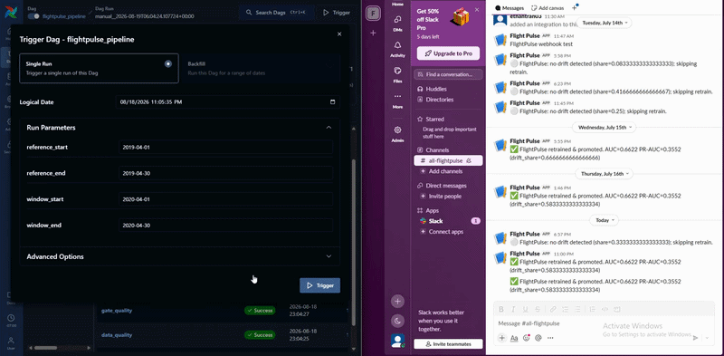
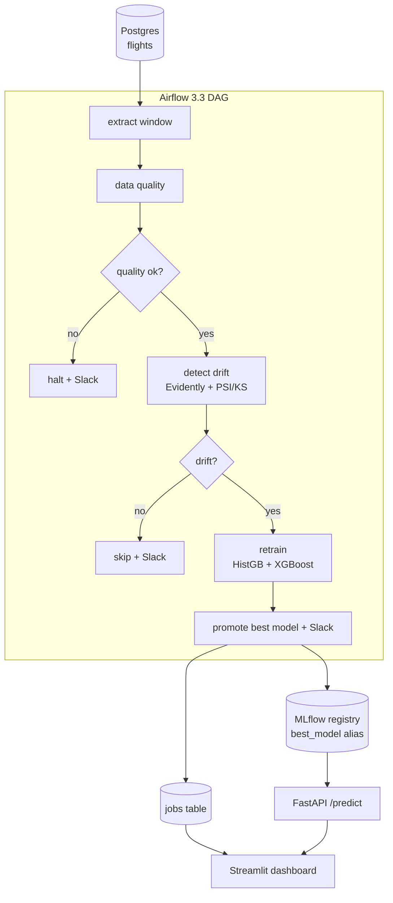

# FlightPulse


**This is a flight delay prediciton pipeline that also detects when the data has drifted**

An Airflow DAG compares each new window of flight data against a reference and branches. It does a halt on bad data, skips when nothing changed, and retrains and creates a new model when it detects drift. This is built with U.S. DOT on-time performance data, a 3M-row sample from 2019 to 2023.



---

## Does the drift detector actually work?

Before pointing it at real data, I checked it against known ground truth.

| Test | Injected change | PSI | Verdict |
|---|---|---|---|
| Specificity | none | 0.0001 | no drift |
| Sensitivity | `distance` scaled 1.6× | 0.3629 | drift|

When changing the model to predict during a COVID period (where flight patterns changed drastically), it recognized the difference and retrained the model accordingly. 

---

## Model results

| Metric | Best Model (XGBoost) |
|---|---|
| ROC-AUC | 0.6622 |
| PR-AUC | 0.3552 |

The flight data has features that cause data leakage with columns such as DEP_DELAY.  When removing those features, predicting from the schedule alone is difficult.  However .66 is common with other similar models like this.  

---

## Architecture


Each run uses one path and every decision is recorded in the jobs table, which also has information of why the pipeline either retrained or remained the same.  

**Stack:** Python 3.11 · Airflow 3.3 · Evidently 0.7 · Deepchecks 0.19 · MLflow 3.12 · scikit-learn 1.7 · XGBoost · FastAPI · Streamlit · PostgreSQL · Docker · GitHub Actions

---

## Quickstart

```bash
git clone https://github.com/stutterk1d/FlightPulse.git
cd FlightPulse
cp .env.example .env
docker compose up -d

kaggle datasets download -d patrickzel/flight-delay-and-cancellation-dataset-2019-2023 \
  -f flights_sample_3m.csv -p data/raw/
python -m src.flightpulse.load_data
```

Airflow http://localhost:8080 · MLflow http://localhost:5000 · API http://localhost:8000/docs · Dashboard http://localhost:8501

Trigger `flightpulse_pipeline` with reference `2019-04-01`/`2019-04-30` and window `2020-04-01`/`2020-04-30` to watch it detect the COVID drift and retrain.

---

Data: [Flight Delay and Cancellation Dataset 2019–2023](https://www.kaggle.com/datasets/patrickzel/flight-delay-and-cancellation-dataset-2019-2023) (Kaggle mirror of U.S. DOT BTS on-time performance). The prediction log is fed by a generator that samples real flights and sends them through the live API.

